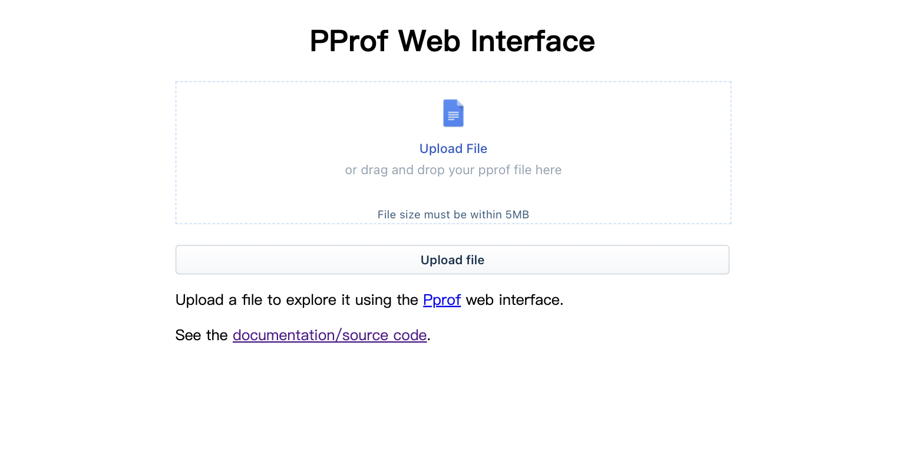
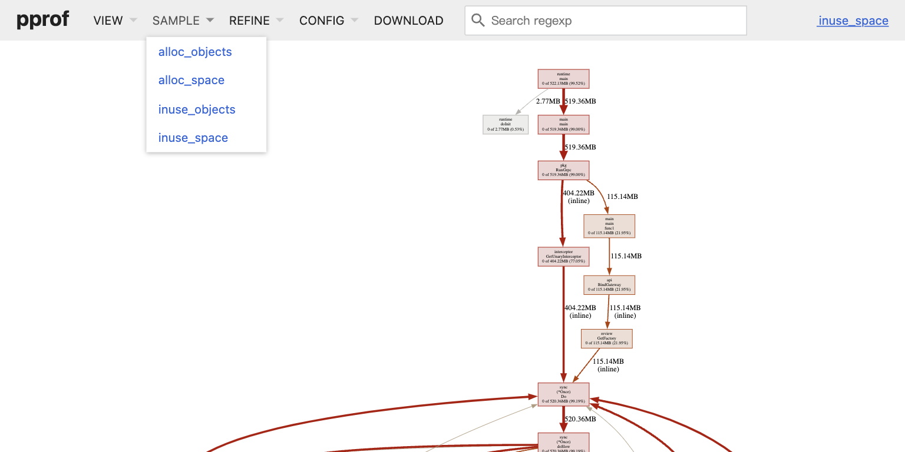

# Pprof Web Visualizer
[](https://github.com/zjc17/pprof-web/actions/workflows/github-code-scanning/codeql)
[](https://github.com/zjc17/pprof-web/actions/workflows/scan.yml)
[](https://github.com/zjc17/pprof-web/actions/workflows/release.yml)
[](https://goreportcard.com/report/github.com/zjc17/pprof-web)
[](https://hub.docker.com/r/lovecho/pprof-web)

<p style="text-align: center;">
  <a href="README.md" target="_blank">ENGLISH</a> | <a href="README_CN.md">中文文档</a>
</p>

Golang Pprof Web Visualizer is a web application that visualizes the output of the pprof tool in a web browser.

The Size of the binary is < 10MB.

Support on WebUI, x86, ARM, Linux and MacOS.





## Download

Download the binaries for your system and architecture from the [release page](https://github.com/zjc17/pprof-web/releases).

If you prefer docker, you can use the following command (DockerHub):

```bash
docker pull lovecho/pprof-web:latest
docker pull lovecho/pprof-web:latest
```

## Usage

Use default parameters to format all configuration files in the current directory:

```bash
./pprof-web
```

This will start a web server on port 8080.

Then you can access it at [localhost:8080](http://localhost:8080).

### Docker Usage

There is no difference between using parameters in Docker and the above, for example, we start a Web UI formatting tool service in Docker:

```bash
docker run --rm -it -p 8080:8080 lovecho/pprof-web:latest
```

## Live Demo

You can access live demo at [pprof.gotool.tech](https://pprof.gotool.tech/).

### Best practice

Upload the pprof result by curl inside a remote machine and then access the web UI from your local machine.

```bash
# upload by curl
curl -F "file=@$FILE_PATH" https://pprof.gotool.tech/submit -v
```

Then you can check the output and find something like below

```bash
< HTTP/2 307
< date: Thu, 27 Apr 2023 08:14:54 GMT
< location: /pprof/?file_id=XXXXXXXX
< vary: Accept-Encoding
< cf-cache-status: DYNAMIC
```

You can then visit `https://pprof.gotool.tech/pprof/?file_id=XXXXXXXX` to view your pprof result.

## Credit

Web Components:

- Gin is a HTTP web framework written in Go (Golang), under [MIT license].
  - https://github.com/gin-gonic/gin
- Crayons - A UI Kit comprising of web components for building Freshworks Apps! - [License not specified yet]
  - https://github.com/freshworks/crayons