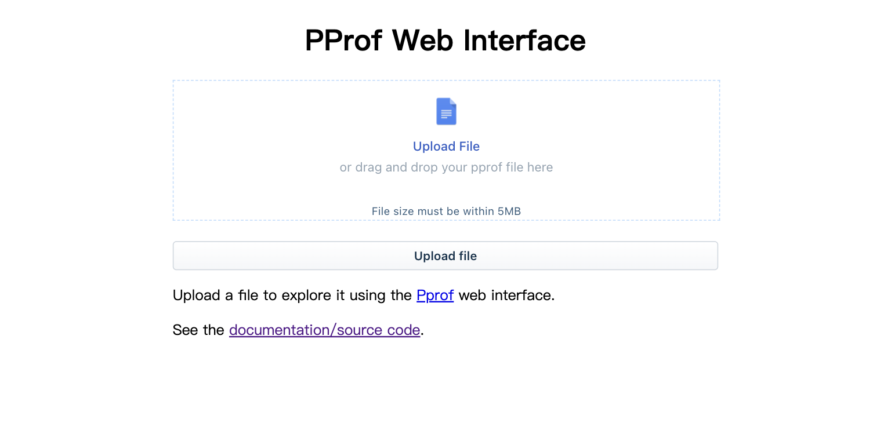
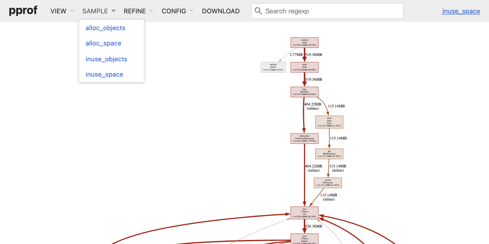

# Pprof Web Visualizer
[](https://github.com/zjc17/pprof-web/actions/workflows/github-code-scanning/codeql)
[](https://github.com/zjc17/pprof-web/actions/workflows/scan.yml)
[](https://github.com/zjc17/pprof-web/actions/workflows/release.yml)
[](https://goreportcard.com/report/github.com/zjc17/pprof-web)
[](https://hub.docker.com/r/lovecho/pprof-web)

<p style="text-align: center;">
  <a href="README.md" target="_blank">ENGLISH</a> | <a href="README_CN.md">中文文档</a>
</p>

Golang Pprof Web Visualizer 是一个网络应用程序，可以在网络浏览器中对 pprof 工具的输出进行可视化。

二进制文件小于10MB。

支持 WebUI, x86, ARM, Linux 和 MacOS。





## 下载

从[发布页](https://github.com/zjc17/pprof-web/releases)下载适合你的系统和架构的二进制文件。

如果你喜欢docker，你可以使用以下命令（DockerHub）：

``bash
docker pull lovecho/pprof-web:latest
docker pull lovecho/pprof-web:latest
```

## 用法

使用默认参数来格式化当前目录下的所有配置文件：

``bash
./pprof-web
```

这将在8080端口启动一个Web服务器。

然后你可以在[localhost:8080](http://localhost:8080)访问它。

### Docker用法

在Docker中使用参数和上面的方法没有区别，例如，我们在Docker中启动一个Web UI格式化工具服务：

```bash
docker run --rm -it -p 8080:8080 lovecho/pprof-web:latest
```

## 信用

网络组件：

- Gin是一个用Go（Golang）编写的HTTP网络框架，在[MIT许可]下。
  - https://github.com/gin-gonic/gin
- Crayons - 一个由Web组件组成的UI工具包，用于构建Freshworks的应用程序! - [还没有指定许可证] 。
  - https://github.com/freshworks/crayons
